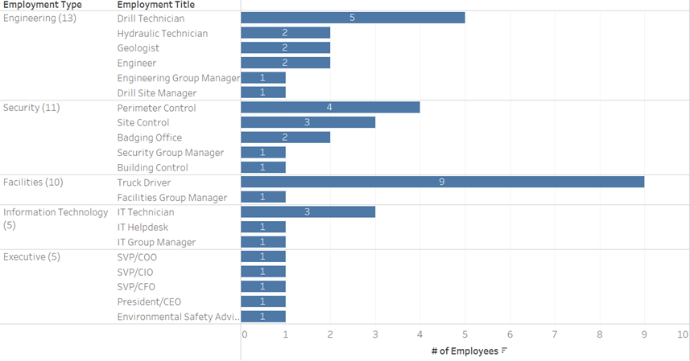
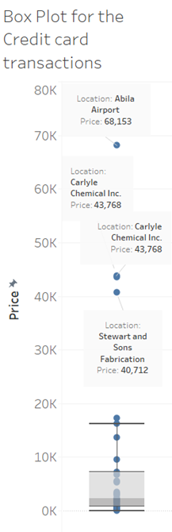
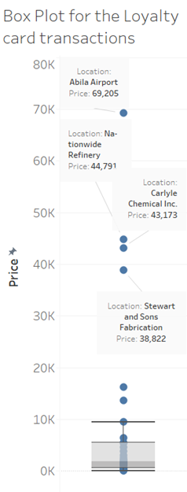

```{r setup, include=FALSE}
knitr::opts_chunk$set(echo = FALSE)
```
 
# Background and Objectives 
 
-----
 
The company in question is GAStech International (“GT”), which operates in Abila, Kronos, has company cars approved for both personal and business use. Those that do not have company cars have the ability to check out company trucks for business use, but not for personal business. These vehicles have geospatial tracking software to track their movement. To add on to this, GT employees are provided with loyalty and credit cards whose usages are also monitored. 
 
We, as visual analytics experts, are supposed to use the above information to assist law enforcement in identifying which GT employees made which purchases and identify suspicious patterns of behaviour and make recommendations for further investigation. 
 
-----
 
# Understanding the Dataset 
 
-----
 
We are provided with the following csv files: 
 
| File                 | Description                                | Variables                                                                                                                            |
|----------------------|--------------------------------------------|--------------------------------------------------------------------------------------------------------------------------------------|
| car-assignments.csv  | A list of vehicle assignments by employee  | Employee Last Name, Employee First Name, Car ID, Current Employment Type (Department), Current Employment Title (job title)          |
| cc_data.csv          | Credit and debit card transaction data     | Timestamp, Location (name of the business), Price, Last 4 digits of the credit or debit card number                                  |
| loyalty_data.csv     | Loyalty card transaction data              | Timestamp, Location (name of the business), Price, Loyalty Number (A 5-character code starting with L that is unique for each card)  |
| gps.csv              | Vehicle tracking data                      | Timestamp, Car ID, Latitude, Longitude                                                                                               |
 
Other information we are provided with are as follows: 
 
* ESRI shapesfiles of Abila, Kronos 
 
* MC2-tourist.jpg, which is a tourist map of Abila, Kronos with locations of interest identified
 

 
-----
 
We will proceed by looking through the CSV files in more detail to further understand the datasets provided.
 
**car-assignments.csv, 44 rows**
 
| Column                  | Type               | Values                                         |
|-------------------------|--------------------|------------------------------------------------|
| LastName                | String             | 44 unique values when combined with FirstName  |
| FirstName               | String             | See LastName                                   |
| CarID                   | Number (Integer)   | 1 to 35                                        |
| CurrentEmploymentType   | String             | 5 unique values                                |
| CurrentEmploymentTitle  | String             | 21 unique values                               |
 
Note: Each employee is allocated 1 car, however, there are 9 employees that are not assigned cars. These 9 employees are truck drivers. 
 
Taking a closer look into CurrentEmploymentType and CurrentEmploymentTitle gives us an overview of the organisation structure.
 

 
Each employee can only have one employment title while one employment title can have 1 or more employees. Each employment type has more than 1 employment title and at least one manager that supervises the department. The identified managers are as follows:
 
|     CurrentEmploymentType     |     CurrentEmploymentTitle (Manager)                    |
|-------------------------------|---------------------------------------------------------|
|     Engineering               |     Engineering Group Manager and Drill Site Manager    |
|     Executive                 |     President/CEO                                       |
|     Facilities                |     Facilities Group Manager                            |
|     Information Technology    |     IT Group Manager                                    |
|     Security                  |     Security Group Control                              |
 
-----
 
**cc-data.csv, 1,490 rows** 
 
| Column       | Type                        | Values                            |
|--------------|-----------------------------|-----------------------------------|
| timestamp    | Date (mm/dd/yyyy) and time  | 1/6/2014 7:28 to 1/19/2014 20:51  |
| location     | String                      | 34 unique values                  |
| price        | Number (Decimal)            | 2.01 to 10,000.00                 |
| last4accnum  | String                      | 55 unique values                  |
 
Plotting the price on a box plot, we have noted the following:
 
{ width=25% }
 
-----
 
**loyalty-data.csv, 1,392 rows** 
 
| Column         | Type               | Values                 |
|----------------|--------------------|------------------------|
| timestamp      | Date (mm/dd/yyyy)  | 1/6/2014 to 1/19/2014  |
| location       | String             | 33 unique values       |
| price          | Number (Decimal)   | 3.00 to 4,983.52       |
| loyaltynumber  | String             | 54 unique values       |
 
Note: Looking at the difference for locations in cc-data and loyalty-data, it seems that Daily Dealz does not offer loyalty points. 
 
Plotting the price on a box plot, we have noted the following:
 
{ width=25% }
 
-----
 
**gps.csv, 685,169 rows**
 
| Column     | Type                        | Values                                                |
|------------|-----------------------------|-------------------------------------------------------|
| timestamp  | Date (mm/dd/yyyy) and time  | 1/6/2014 6:28 to 1/19/2014 20:56                      |
| id         | Number (Integer)            | 40 unique values (1 to 35, 101, 104, 105, 106, 107)   |
| lat        | Number (Decimal)            | 36.04802 to 36.08996                                  |
| long       | Number (Decimal)            | 24.82509 to 24.90849                                  |
 
It looks like IDs 1 to 35 corresponds to carID in car-assignment.csv. Assume that 101, 104, 105, 106, 107 are Truck IDs. This is interesting to note that this means there are 5 trucks for 9 truck drivers. 
 
-----
 
# Methodology and Scope
 
-----
 
We aim to answer the following questions found in VAST 2021 Mini-challenge 2: 
 
1. Using just the credit and loyalty card data, identify the most popular locations, and when they are popular. What anomalies do you see? What corrections would you recommend to correct these anomalies? 
 
2. Add the vehicle data to your analysis of the credit and loyalty card data. How does your assessment of the anomalies in question 1 change based on this new data? What discrepancies between vehicle, credit, and loyalty card data do you find?  
 
3. Can you infer the owners of each credit card and loyalty card? What is your evidence? Where are there uncertainties in your method? Where are there uncertainties in the data? 
 
4. Given the data sources provided, identify potential informal or unofficial relationships among GASTech personnel. Provide evidence for these relationships.  
 
5. Do you see evidence of suspicious activity? Identify 1-10 locations where you believe the suspicious activity is occurring, and why? 
 
-----
 
In order to answer the above questions, this will be the scope and methodology we hope to follow these steps:
 
1. Analysis of dataset with background research 
 
2. Exploratory Data Analysis (EDA) methods in R 
 
3. Exploratory Spatial Data Analysis (ESDA) methods in R 
 
4. R Markdown development for functionality checks 
 
5. R-Shiny app development for user interactivity 
 
-----
 
We hope the answer the VAST questions by using data analysis in steps 2 and 3 to answer the following questions based off our understanding of the datasets in step 1 :
 
| VAST Questions  | Dataset Questions                                                                                                                                                                                                                                                                                                                                                                                                               |
|-----------------|---------------------------------------------------------------------------------------------------------------------------------------------------------------------------------------------------------------------------------------------------------------------------------------------------------------------------------------------------------------------------------------------------------------------------------|
| 1, 2 and 3      | Which employees have been at which locations at the same time? Which cards and vehicles are used during then? <br>There are 54 and 55 unique loyalty and CC cards respectively, however, there are only 44 unique employees. How were these extra cards used? <br>There are 35 and 34 unique locations where the cc has been used and loyalty points have been issued. Which location is the most popular among the employees?  |
| 4 and 5         | Have the supervisors been supervising their employees? <br>Do employees from different employment types and titles hang out together? <br>Which employees have the highest interactions with truck drivers and where?                                                                                                                                                                                                           |
